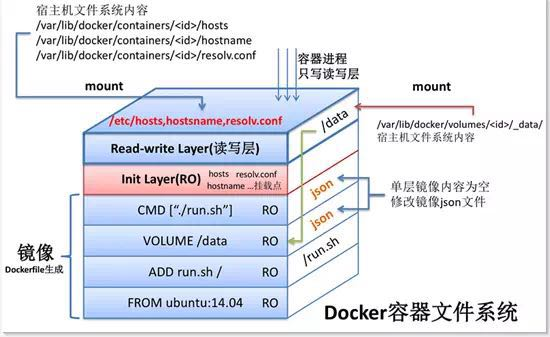

# docker
## 概念
### 容器
轻量级的应用打包分发技术,是为了解决应用运行环境的一致性而开发, 组成部分:
- 应用本身
- 应用依赖的运行环境rootfs(即容器镜像)

### OCI, Open Container Initiative
定义容器规范的组织, 现有规范:
- runtime spec : 管理容器和容器镜像的软件, runC是该规范的实现
- image format spec : 定义容器镜像的标准

### 编排引擎
管理集群资源的生命周期并提供服务, 包括容器管理/调度, 集群定义, 服务发现. 当前主流是Kubernetes.

### 架构
[图解 Docker 架构(细)](https://www.hi-linux.com/posts/13732.html)

docker是典型的C/S架构:
- docker cli : 向docker daemon发送请求
- docker daemon : 根据docker cli的请求创建,运行,监控容器; 构建,存储镜像. 默认仅监听localhost client的请求.

## 镜像
参考:
- [深入分析 Docker 镜像原理](http://blog.daocloud.io/principle-of-docker-image/)

镜像的实现使用了Union File System 也叫 UnionFS，其最主要的功能是将多个不同位置的目录联合挂载（union mount）到同一个目录下.

所有对容器的改动, 包括添加, 修改, 删除都只发生在容器层(即可读写层), 细节:
1. 添加 : 发生在容器层
1. 读取 : Docker会从上往下依次在各层查找, 找到后载入内存
1. 修改 : 不在容器层时，Docker会从上往下依次在各层查找, 找到后复制到容器层, 再修改
    使用了CopyOnWrite机制: 仅当需要修改时才复制数据, 优势是共享数据，减少物理空间占用
1. 删除 : 只读层存在删除对象时使用 whiteout(对文件)/opaque(对目录) 机制: 通过在容器层建立对应的 whiteout/opaque，来遮挡下层分支中的所有路径名相同的文件/目录

当前默认GraphDriver是overlay2. overlay2仅有两层, 性能上比使用多层的aufs(不推荐)有优势.

### 创建镜像
1. 基于已有镜像的容器创建(不推荐) : `docker commit`
1. 基于本地模板导入 : `docker import`
1. 基于Dockerfile创建, **推荐**
    构建失败时, 可`docker run ${上一步构建成功的中间镜像}`用于调试Dockerfile

### [Dockerfile](https://docs.docker.com/engine/reference/builder/)
`FROM scratch`表示从零开始构建,不推荐: 因为没有常用的调试工具. 常用alpine.

## docker运行
容器的生命周期依赖启动时执行的命令, 只要该命令不结束, 容器就会一直运行.

容器的启动命令可通过`docker ps -a`中的`COMMAND`列查看.

docker run的restart策略:
- no : 容器退出时不要自动重启, 是默认值
- always : 无论容器因何原因退出(包括正常退出)都立即重启
- on-failure[:max-retries] : 只在容器**以非0状态码退出时重启**. 可选的max-retries表示尝试重启容器的次数
- unless-stopped : 不管退出状态码是什么始终重启容器, 但是不考虑在Docker daemon启动时就已经停止了的容器

### 资源限制
资源限制可使用`progrium/stress`镜像验证.

docker run的资源限制参数:
- -m : 内存限制
- --memory-swap : 内存+swap的限制
- -c : 使用cpu的权重(仅cpu资源紧张的情况下有效), 具体分配到的cpu取决于该值占所有容器cpu share总和的比例.
- --blkio-weight : io的权重值, 也`-c`类似

## 网络
通过`docker run`的`--network`指定:
- none : 使用none网络, 即网卡上仅有`lo`项
- host : 共享host的网络, 即容器的网络配置与host完全一样
    最大好处是性能, 坏处是要考虑与host的端口冲突
- bridge : linux bridge(可通过`brctl show`查看), 是docker的默认网络, `docker0`是docker安装时创建
    
    Docker每创建一个`network`的容器都会执行如下操作：
    1. 创建一对虚拟接口，即veth pair，分别放到宿主机和容器中(该容器退出时也会删除其veth pair)
    1. 主机一端桥接到默认的docker0或指定网桥上，具有一个唯一的名字，如vethXXX(veth0ac844e)
    1. 另一端放到新容器中，并修改名字为eth0，该接口只在容器的命名空间可见
    1. 从网桥可用地址段中获取一个空闲地址分配给容器的eth0，并配置默认路由到桥接网卡veth0ac844e

    注意: 只有创建bridge时指定`--subnet`才允许使用`--ip`指定静态ip
- user-defined网络 : bridge, overlay, macvlan

> bridge, none仅支持单机通信.
> docker默认禁止bridge间通信(通过iptables), 可通过`docker network connect`添加对应的网卡解决
> Docker1.12以后提供了docker network来替代`--link`方式来实现容器互联

### 容器间通信:
- ip : 容器在同一个网络即可: 创建时使用`--network`指定网络或使用`docker network connect`将现有容器加入指定网络
- dns : 为了解决部署应用前无法确定ip的情况, 创建容器时使用`--name`命名容器即可.
- joined : 通过`--network=Container:xxx`共享指定容器的network namespace, 适用于:
    1. 不同容器希望通过loopback快速通信
    1. 希望监控其他容器的网络流量

> 默认的bridge(docker0)无法使用dns, 但user-defined创建的bridge可以.

### 容器与外部网络的互访
这里的外部网络是指非当前使用的容器网络

#### 容器访问外部网络
容器默认就能访问外网, 比如`ping www.baidu.com`.

#### 外部网络访问容器
通过容器启动时指定`-p`指定端口映射

每个映射的端口都会启动一个docker-proxy来处理访问容器的流量.

### 跨host通信
这里仅了解, 跨host通信推荐使用k8s.

参考:
- [容器网络聚焦：CNM和CNI](http://www.dockerinfo.net/3772.html)
- [每天5分钟玩转Docker容器技术#容器网络]

解决方案:
- CNM(Container Network Model), Libnetwork是CNM的原生实现, 它为Docker daemon和网络驱动程序之间提供了接口.
- CNI : 被k8s采用, 会成为未来容器网络的标准, 推荐.

具体实现:
- docker 原生的overlay和macvlan
- 第三方的flannel, calico, weave等

对比: Underlay网络性能优于Overlay; Overlay支持等多的二层网段, 更能利用已有的网络以及能避免物理交换机MAC表耗尽等

## 存储
由storage driver管理的镜像层和容器层 + volume组成

storage driver目前支持overlay2(linux默认, 已进入linux kernel), aufs, device mapper, btrfs, vfs, zfs. 可通过`docker info`查看默认dirver.

> storage driver选择: docker安装时指定的默认dirver即可.
> docker也支持[第三方的volume](https://docs.docker.com/engine/extend/legacy_plugins/#Volume plugins)以实现跨host共享数据.

### volume
本质是docker host文件系统上的目录或文件, 可以被mount到容器中, 用于持久化数据, 可通过`docker inspect`查看.

docker支持两种volume:
1. bind mount : 使用`-v`参数将host上已存在的目录或文件mount到容器
1. docker managed volueme

#### bind mount
格式: `${host path}:${Container path}[:读写权限]`.
删除数据的工作由host负责.

> `host path`是单文件时, 该文件必须存在, 否则将会当做一个新目录mount到容器

#### docker managed volume
与bind mount最大区别是`-v`参数不需要指定mount src, 便于容器迁移, 比如容器迁移时mount src不存在而失败.

此时docker会在`/var/lib/docker/volumes`下创建一个**随机目录**来作为`mount src`.

> 如果mount dist已存在, docker会先将其下数据复制到mount src后在mount.

docker rm时带上`-v`即可删除, 前提是没有其它容器mount了该volume, 这是为了保护数据; 没带`-v`删除时会产生孤儿volume, 可通过`docker volume`对docker managed volume进行维护.

### 数据共享
#### 容器与host
bind mount(推荐)/docker managed volume

> docker managed volume是容器启动时生成的随机目录, 因此推荐使用bind mount.
> `docker cp` 允许容器和host间复制数据.

#### 容器间
方法:
1. 通过bind mount将要共享的数据mount到多个容器
1. volume container(推荐), 其支持bind mount/docker managed volume, 其他容器通过`--volumes-from`引入`volume container`

data-packed volume container : 将数据打包到镜像中, 其他容器再通过`--volumes-from`引入. 它不依赖host, 具有很强的移植性, 非常适合只使用静态数据的场景, 比如应用的配置, web server的static files.

## 监控
参考:
- [每天5分钟玩转Docker容器技术#容器监控]

- docker 自带 :`docker container stats`, `docker container ps`,`docker container top CONTAINER`
- 第三方 : sysdig, Weave Scope, cAdvisor, Prometheus(推荐)

### sysdig
仅显示实时数据, 没有变化和趋势

## 日志
将容器日志发送到stdout,stderr是dcoker的默认日志行为.

docker的 logging driver(从运行的容器中提取日志)默认是`json-file`, 可通过`docker info|grep 'Logging Driver'`查看. 容器的日志在`/var/lib/docker/containers/${container id}/${container id}-json.log`里.

> [docker 支持的logging driver在这里](https://docs.docker.com/config/containers/logging/configure/#Supported logging drivers)

## 容器编排
解决方案:
- docker compose : 小规模/测试
- k8s : 大规模, **推荐**

## 开发
- [循序渐进学Docker#Docker插件开发]
- [循序渐进学Docker#Docker源码探索], 使用`sourcegraph.com`阅读

## 实践
- [美团容器平台架构及容器技术实践](https://tech.meituan.com/2018/11/15/docker-architecture-and-evolution-practice.html)
- [HECD = Haproxy + Etcd + Cond + Docker]