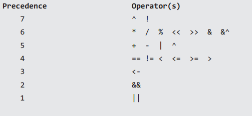

## 接口

参考:[golang反射规则使用详解](http://www.sharejs.com/codes/go/7309)

接口类型的变量存储了两个内容：***赋值给变量实际的值**和**这个值的类型描述**。更准确的说，值是底层实现了接口的实际数据内容，而类型描述了这个项目完整的类型。例如下面，

```go
var r io.Reader
tty, err = os.OpenFile("/dev/tty", os.O_RDWR, 0)
if err != nil { return nil, err }
r = tty
```

用模式的形式来表达 r 包含了的是 (value, type) 对，如 (tty, *os.File)。

注意: 类型 *os.File 除了 Read 方法还实现了其他方法：尽管接口值仅仅提供了访问 Read 方法的可能（即通过r 只能访问Read方法），但是内部包含了这个值的完整的类型信息（反射的依据）。
这也就是为什么可以这样做：

```go
var w io.Writer
w = r.(io.Writer) //接口查询
```

在这个赋值中的断言是一个类型断言：它断言了 r 内部的条目同时也实现了 io.Writer，因此可以赋值它到 w。在赋值之后，w 将会包含 (tty, *os.File)，跟在 r 中保存的一致。接口的静态类型决定了哪个方法可以通过接口变量调用，即便内部实际的值可能有一个更大的方法集。

接下来，可以这样做：

```go
view sourceprint?
var empty interface{}
empty = w
```

而空接口值 e 也将包含同样的 (tty, *os.File)。这很方便：空接口可以保存任何值同时保留关于那个值的所有信息。

（这里无需类型断言，因为 w 是肯定满足空接口的。在这个例子中，将一个值从 Reader 变为 Writer，由于 Writer 的方法不是 Reader 的子集，所以就必须明确使用类型断言。）

**一个很重要的细节是接口内部的对总是 (value, 实际类型) 的格式，而不会有 (value, 接口类型) 的格式。接口不能保存接口值。**

### interface何时为nil

```go
package main

import "fmt"

type Stringer interface {
	String() string
}
type String struct {
	data string
}

func (s *String) String() string {
	return s.data
}

func GetString() *String {
	return nil
}

func CheckString(s Stringer) bool {
	//interface底层实际上是一个结构体，包括两个成员，一个是指向数据的指针，一个包含了成员的类型信息,两者同时为nil时接口才是nil
	//此处接口s里存储的类型明显不为nil,而是*String
	return s == nil
}

func main() {
	fmt.Printf("%#v,%t\n", GetString(), GetString() == nil)
	println(CheckString(GetString()))
	var a interface{}

    //nil可看成是<nil>(nil)(空类型的空指针)
    //nil只能赋值给pointer,channel,func,interface,map,slice类型的变量,详见http://pkg.golang.org/pkg/builtin/#Type
	fmt.Printf("%#v,%t\n", a, a == nil)
}

// Output:
// (*main.String)(nil),true
// false
// <nil>,true
```

## 接口查询

接口查询是否成功，要在运行期才能够确定。他不像接口的赋值，编译器只需要通过静态类型检查即可判断赋值是否可行。

```go
var file1  Writer = ...
if file5,ok := file1.(two.IStream);ok {
...
}
```
这个if语句检查file1接口指向的对象实例是否实现了two.IStream接口，如果实现了，则执行特定的代码。

在Go语言中，你可以询问它指向的对象是否是某个类型，比如，

```go
var file1 Writer = ...
if file6,ok := file1.(*File);ok {
...
}
```
这个if语句判断file1接口指向的对象实例是否是*File类型，如果是则执行特定的代码。
```go
slice := make([]int, 0)
slice = append(slice, 1, 2, 3)

var I interface{} = slice


if res, ok := I.([]int)；ok {
    fmt.Println(res) //[1 2 3]
}
这个if语句判断接口I所指向的对象是否是[]int类型，如果是的话输出切片中的元素。
```
```go
func Sort(array interface{}, traveser Traveser) error {

  if array == nil {
    return errors.New("nil pointer")
  }
  var length int //数组的长度
  switch array.(type) {
  case []int:
    length = len(array.([]int))
  case []string:
    length = len(array.([]string))
  case []float32:
    length = len(array.([]float32))

  default:
    return errors.New("error type")
  }

  if length == 0 {
    return errors.New("len is zero.")
  }

  traveser(array)

  return nil
}
```
通过使用.(type)方法可以利用switch来判断接口存储的类型。

小结: 查询接口所指向的对象是否为某个类型的这种用法可以认为是接口查询的一个特例.

## 类型转换（Conversions）

类型转换的语法：

```go
Conversion = Type "(" Expression [ "," ] ")"
```
当以运算符*或者<-开始，有必要加上括号避免模糊：

```go
*Point(p)        // same as *(Point(p))
(*Point)(p)      // p is converted to *Point
<-chan int(c)    // same as <-(chan int(c))
(<-chan int)(c)  // c is converted to <-chan int
func()(x)        // function signature func() x
(func())(x)      // x is converted to func()
(func() int)(x)  // x is converted to func() int
func() int(x)    // x is converted to func() int (unambiguous)
```

## Type switch与Type assertions

在Go语言中，我们可以使用type switch语句查询接口变量的真实数据类型，语法如下：

```go
//x必须是接口类型
switch x.(type) {
// cases
}
```

来看一个详细的示例：

```go
type Stringer interface {
    String() string
}

//语句switch中的value必须是接口类型，变量str的类型为转换后的类型
var value interface{} // Value provided by caller.
switch str := value.(type) {
case string:
    return str //type of str is string
case Stringer: //type of str is Stringer
    return str.String()
}
```

If the switch declares a variable in the expression, the variable will have the corresponding type in each clause. It is also idiomatic to reuse the name in such cases, in effect declaring a new variable with the same name but a different type in each case.
如果我们只关心一种类型该如何做？如果我们知道值为一个string，只是想将它抽取出来该如何做？只有一个case的类型switch是可以的，不过也可以用类型断言（type assertions）。

类型断言接受一个接口值，从中抽取出显式指定类型的值。其语法借鉴了类型switch子句，不过是使用了显式的类型，而不是type关键字，如下：

```go
//同样，x必须是接口类型
x.(T)
```

str := value.(string)
上面的转换有一个问题，如果该值不包含一个字符串，则程序会产生一个运行时错误。为了避免这个问题，可以使用“comma, ok”的习惯用法来安全地测试值是否为一个字符串：

```go
//如果类型断言失败，则str将依然存在，并且类型为字符串，不过其为零值
str, ok := value.(string)
if ok {
    fmt.Printf("string value is: %q\n", str)
} else {
    fmt.Printf("value is not a string\n")
}
```

我们可以使用类型断言来实现type switch的中例子：
```go
//这种做法没有多大实用价值
if str, ok := value.(string); ok {
    return str
} else if str, ok := value.(Stringer); ok {
    return str.String()
}
```

## reflect/反射

参考:

- [golang反射规则使用详解](http://mikespook.com/2011/09/%E5%8F%8D%E5%B0%84%E7%9A%84%E8%A7%84%E5%88%99/)

### 根据reflect.Value.Type()初始化变量

```go
package main

import (
	"fmt"
	"reflect"
)

func main() {
	var a []int  //未初始化

	var value reflect.Value = reflect.ValueOf(&a)

	value = reflect.Indirect(value) //使指针指向内存地址
	fmt.Println(value.Kind())
    //>>slice

    fmt.Println(value.Interface().([]int) == nil)
    //>>true

	value = reflect.New(value.Type()) //初始化后返回指针
	fmt.Println(value.Kind())
	//>>ptr

	value = reflect.Indirect(value) //使指针指向内存地址
	fmt.Println(value.Kind())
	//>>slice
}
```

### reflect->struct 的例子

```go
package main

import (
	"fmt"
	"reflect"
)

type User struct {
	Name string
}

func (u *User) Hello() string {
	return "hello"
}
func (u *User) ShakeHand(name string) {
	fmt.Printf("Shake hand with %s\n", name)
}
func main() {
	u := &User{Name: "xxxx"}
	value := reflect.ValueOf(u)
	fmt.Printf("%s\n", value.Kind()) //Kind()获取底层结构

	value1 := reflect.Indirect(value) //获取内存里的实际值
	typ1 := value1.Type()
	fmt.Println(typ1.NumField()) //值包含字段的个数
	for i := 0; i < typ1.NumField(); i++ {
		fmt.Printf("Field %d: %s [%s]: %v\n",
			i, typ1.Field(i).Name, value1.Field(i).Type(), value1.Field(i))
	}
	fmt.Println(value1.CanSet())                              //判断值是否可设置性,反射时传入指针即为可设置
	value1.FieldByName("Name").Set(reflect.ValueOf("hellos")) //设置字段
	fmt.Println(value1.Interface())//从 reflect.Value 可以使用 Interface 方法还原接口值,即方法高效的打包类型和值信息到接口表达中，并返回这个结果
	value1.FieldByName("Name").SetString("hellos2")
	fmt.Println(value1.Interface())
	fmt.Println("-------------------")

	typ := value.Type()
	fmt.Println(typ.NumMethod()) //值的方法个数

	for i := 0; i < value.NumMethod(); i++ {
		fmt.Printf("method[%d]%s\n", i, typ.Method(i).Name) //值的方法的名称
	}
	fmt.Println("-------------------")

	b := value.MethodByName("Hello").Call(nil)
	fmt.Printf("%T\n", b) //golang函数可多值返回的原因
	fmt.Println(b[0])
	fmt.Println("-------------------")

	params := make([]reflect.Value, 1)
	params[0] = reflect.ValueOf("18")
	c := value.MethodByName("ShakeHand").Call(params) //反射调用方法
	fmt.Printf("%d", len(c))
}
/*
ptr
1
Field 0: Name [string]: xxxx
true
{hellos}
{hellos2}
-------------------
2
method[0]Hello
method[1]ShakeHand
-------------------
[]reflect.Value
hello
-------------------
Shake hand with 18
0
*/
```

> [reflect.Indirect和v.Elem()比较](http://stackoverflow.com/questions/24318389/golang-elem-vs-indirect-in-the-reflect-package)
>
> If a reflect.Value is a pointer, then v.Elem() is equivalent to reflect.Indirect(v). If it is not a pointer, then they are not equivalent:
>
>-  If the value is an interface then reflect.Indirect(v) will return the same value, while v.Elem() will return the contained dynamic value.
>-  If the value is something else, then v.Elem() will panic.
>
> The reflect.Indirect helper is intended for cases where you want to accept either a particular type, or a pointer to that type. One example is the database/sql conversion routines: by using reflect.Indirect, it can use the same code paths to handle the various types and pointers to those types.

## Go：保留关键字及基本数据类型

### 命名规范

在Go中几乎所有的东西都是有名字或标识符的（类似于C家族语言），且它们是对大小写敏感的。相应的规则如下：

- 必须以字符开头（所有Unicode UTF-8中的字符 或 下划线“_”）,后面可以跟0或多个字符或数字，如：x56, _x32等。
- 不能以数字开头或系统保留关键字和操作符。如：1ab, case, a+b。
- 下划线"_"本身在Go中是一个特殊的标识符，称为空标识符。可以代表任何其它的标识符，但是它对应的值会被忽略。所以仅能被作为占位符使用。

同时，在Go中也支持匿名，如匿名变量、自定类型和函数。

### 系统关键字或保留字

在Go中，为了简化代码编译过程中对代码的解析，其定义的保留关键字只有25个。详见如下：

break 	default 	func 	interface 	select
case 	defer 	go 	map 	struct
chan 	else 	goto 	package 	switch
const 	fallthrough 	if 	range 	type
continue 	for 	import 	return 	var

除了保留关键字外，外另还提供了36个预定的标识符，其包括基础数据类型和系统内嵌函数。

append 	bool 	byte 	cap 	close 	complex
complex64 	complex128 	uint16 	copy 	false 	float32
float64 	imag 	int 	int8 	int16 	uint32
int32 	int64 	iota 	len 	make 	new
nil 	panic 	uint64 	print 	println 	real
recover 	string 	true 	uint 	uint8 	uintprt

#### 内嵌数据类型

- Boolean类型：

		系统为此类型定义了两个常量：true 和 false.
        初始默认值为：false。
        格式化输出时的格式字符串为：%t

- Byte类型：

    	为uint8的别外，即只有8个bit。

- 数字类型：

 - 整数类型：
		有符号整数：int8， int16， int32， int64和int（此类型会根据特定的平台可能会有所不同）
        无符号整数：uint8， uint16， uint32， uint64和uint （此类型会根据特定的平台可能会有所不同）
        初始默认值为：0。
        格式化输出时的格式字符串为：%d，输出16进制：%x或%X；8进制：%o。

 - 浮点类型：float32 和 float64
        初始默认值为：0.0。
        注意：这里没有float的类型，且两个浮点数比较时不能使用== 和 !=
        格式化输出时的格式字符串为：%g，%f则对应浮点类型的指针；%e则对应科学计数法办输出；%n.mg用于指定小数位输出(n指定浮点数的输出宽度，m指定浮点数的输出精度)。

 - 复数类型：
        complex64：实数与虚数都是32位
        complex128： 实数与虚数都是64位
        real（c）：获取实数部分
        imag（c）：获取虚数部分
        格式化输出时的格式字符串为：%v， 另外也可以使用%f输出实部和虚部。

- 字符类型：
	  严格的说，在Go中没有此类型类型，它是特殊的整数类型,包含在单引号中。
      它对应uint8类型，对传统的ASCII码对应，占1byte。
      同时也支持Unicode（UTF-8）的编码，所以它可能点多个byte，被称为Unicode code points或runes。此时它对应的rune(int32)的数字类型。
      Unicode的字符通常以16进制的形式表示（\u+4或\U+8）
      格式化输出时的格式字符串为：%c；%v或%d则显示对应的整数值；%U则输出：U+hhhh

- 字符串类型：
      一串UTF-8编码格式的字符序列（每个字符可能占1~4byte）
      包含在双引号中，只能在独立的一行内。（Interpreted string）
      包含在反引号中，可以跨越多行。（raw string）
      注：Go所有的代码都是UTF-8格式，所以不存在对字符进行编码和解码。
      它是不可变的值类型，所以不能直接修改字符串。
    指针类型：
      长度和uint一样
      各种数据类型都有对应的指针类型。
      声明方法类似于C中对指针的声明： *type。


### 操作符

- 逻辑运算符：
      与：&&，或：||，非：！。
      ==，!=，<，>，<=，>=
- 位运算符：
      按位与：&，按位或：|，按位异或：^
      左移：<<，右移：>>。（空位补0）
      位清除:&^ 
- 算术运算符：
      +，-，*，/。
      取模：%
      简化操作：-=，*=， +=， %=
      ++， --。（只能在数字变量的后面，不能放在开头，这是与C，Java不一样的地方）
- 优先级：（7 -> 1：由高到低）

	

其他参考:

- [Go 编程语言规范(英文)](http://golang.org/ref/spec)
- [Go 编程语言规范(中文)](http://ilovers.sinaapp.com/doc/golang-specification.html)

