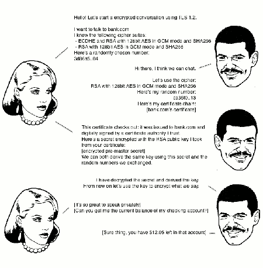
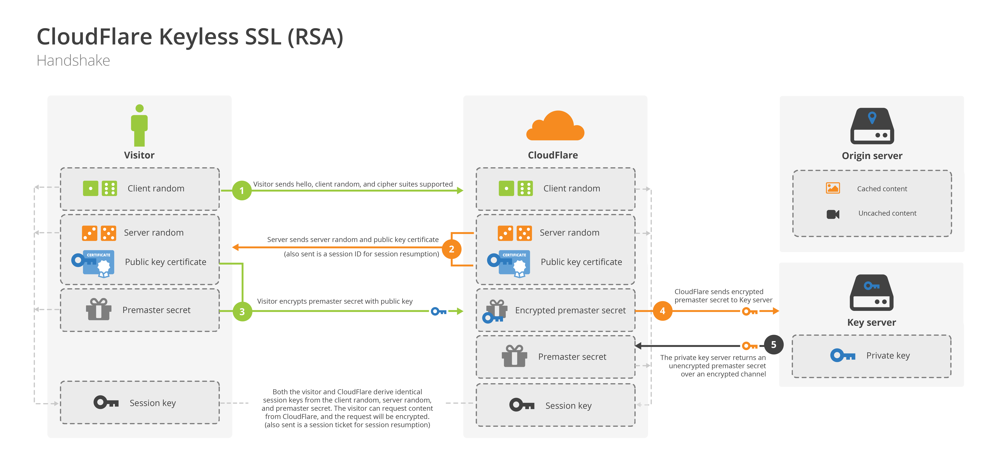
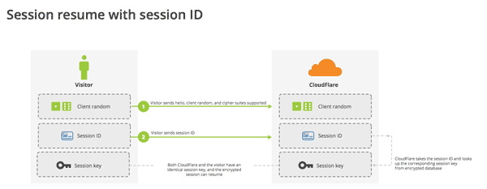

# 图解SSL/TLS协议

[原文](http://www.ruanyifeng.com/blog/2014/09/illustration-ssl.html)

本周(2014年9月20日所在周)，CloudFlare宣布，开始提供Keyless服务，即你把网站放到它们的CDN上，不用提供自己的私钥，也能使用SSL加密链接。

我看了CloudFlare的说明（[这里](https://blog.cloudflare.com/announcing-keyless-ssl-all-the-benefits-of-cloudflare-without-having-to-turn-over-your-private-ssl-keys/)和[这里](http://blog.cloudflare.com/keyless-ssl-the-nitty-gritty-technical-details/)），突然意识到这是绝好的例子，可以用来说明SSL/TLS协议的运行机制。它配有插图，很容易看懂。

下面，我就用这些图片作为例子，配合我半年前写的[《SSL/TLS协议运行机制的概述》](2015_05_23_010.md)，来解释SSL协议。

一、SSL协议的握手过程

开始加密通信之前，客户端和服务器首先必须建立连接和交换参数，这个过程叫做握手（handshake）。

假定客户端叫做爱丽丝，服务器叫做鲍勃，整个握手过程可以用下图说明（点击看大图）。

握手阶段分成五步。

    第一步，爱丽丝给出协议版本号、一个客户端生成的随机数（Client random），以及客户端支持的加密方法。

    第二步，鲍勃确认双方使用的加密方法，并给出数字证书、以及一个服务器生成的随机数（Server random）。

    第三步，爱丽丝确认数字证书有效，然后生成一个新的随机数（Premaster secret），并使用数字证书中的公钥，加密这个随机数，发给鲍勃。

    第四步，鲍勃使用自己的私钥，获取爱丽丝发来的随机数（即Premaster secret）。

    第五步，爱丽丝和鲍勃根据约定的加密方法，使用前面的三个随机数，生成"对话密钥"（session key），用来加密接下来的整个对话过程。

上面的五步，画成一张图，就是下面这样。

二、私钥的作用

握手阶段有三点需要注意。

    （1）生成对话密钥一共需要三个随机数。

    （2）握手之后的对话使用"对话密钥"加密（对称加密），服务器的公钥和私钥只用于加密和解密"对话密钥"（非对称加密），无其他作用。

    （3）服务器公钥放在服务器的数字证书之中。

从上面第二点可知，整个对话过程中（握手阶段和其后的对话），服务器的公钥和私钥只需要用到一次。这就是CloudFlare能够提供Keyless服务的根本原因。

某些客户（比如银行）想要使用外部CDN，加快自家网站的访问速度，但是出于安全考虑，不能把私钥交给CDN服务商。这时，完全可以把私钥留在自家服务器，只用来解密对话密钥，其他步骤都让CDN服务商去完成。

上图中，银行的服务器只参与第四步，后面的对话都不再会用到私钥了。

三、DH算法的握手阶段

整个握手阶段都不加密（也没法加密），都是明文的。因此，如果有人窃听通信，他可以知道双方选择的加密方法，以及三个随机数中的两个。**整个通话的安全，只取决于第三个随机数（Premaster secret）能不能被破解**。

虽然理论上，只要服务器的公钥足够长（比如2048位），那么Premaster secret可以保证不被破解。但是为了足够安全，我们可以考虑把握手阶段的算法从默认的[RSA算法](http://www.ruanyifeng.com/blog/2013/06/rsa_algorithm_part_one.html)，改为 [Diffie-Hellman算法（简称DH算法）](http://zh.wikipedia.org/wiki/%E8%BF%AA%E8%8F%B2%EF%BC%8D%E8%B5%AB%E5%B0%94%E6%9B%BC%E5%AF%86%E9%92%A5%E4%BA%A4%E6%8D%A2)。

采用DH算法后，Premaster secret不需要传递，双方只要交换各自的参数，就可以算出这个随机数。

上图中，第三步和第四步由传递Premaster secret变成了传递DH算法所需的参数，然后双方各自算出Premaster secret。这样就提高了安全性。

四、session的恢复

握手阶段用来建立SSL连接。如果出于某种原因，对话中断，就需要重新握手。

这时有两种方法可以恢复原来的session：一种叫做session ID，另一种叫做session ticket。

session ID的思想很简单，就是每一次对话都有一个编号（session ID）。如果对话中断，下次重连的时候，只要客户端给出这个编号，且服务器有这个编号的记录，双方就可以重新使用已有的"对话密钥"，而不必重新生成一把。

上图中，客户端给出session ID，服务器确认该编号存在，双方就不再进行握手阶段剩余的步骤，而直接用已有的对话密钥进行加密通信。

session ID是目前所有浏览器都支持的方法，但是它的缺点在于session ID往往只保留在一台服务器上。所以，如果客户端的请求发到另一台服务器，就无法恢复对话。session ticket就是为了解决这个问题而诞生的，目前只有Firefox和Chrome浏览器支持。

上图中，客户端不再发送session ID，而是发送一个服务器在上一次对话中发送过来的session ticket。这个session ticket是加密的，只有服务器才能解密，其中包括本次对话的主要信息，比如对话密钥和加密方法。当服务器收到session ticket以后，解密后就不必重新生成对话密钥了。

---
ps:

上文提到的的session(TLS/SSL session)恢复的方法分别是指session ID/Session Cache (RFC 5246) 和 session ticket (RFC 5077).

参考:

- [大型网站的 HTTPS 实践（三）——基于协议和配置的优化](http://op.baidu.com/2015/04/https-s01a03/)
- [高性能浏览器网络（High Performance Browser Networking） 第四章](http://blog.csdn.net/xingtian713/article/details/11953057)

## Session ID

Session ID 的原理是使用 client hello 中的 session id 查询服务端的 session cache, 如果服务端有对应的缓存，则直接使用已有的 session 信息提前完成握手，称为简化握手。

　　Session cache 有两个缺点：

　　1， 需要消耗服务端内存来存储 session 内容。
　　2， 目前的开源软件包括 nginx,apache 只支持单机多进程间共享缓存，不支持多机间分布式缓存，对于百度或者其他大型互联网公司而言，单机 session cache 几乎没有作用。

　　Session cache 也有一个非常大的优点：

　　1， session id 是 TLS 协议的标准字段，市面上的浏览器全部都支持 session cache。

　　百度通过对 TLS 握手协议及服务器端实现的优化，已经支持全局的 session cache，能够明显提升用户的访问速度，节省服务器计算资源。

## Session ticket

　　上节提到了 session cache 的两个缺点，session ticket 能够弥补这些不足。

　　Session ticket 的原理参考 RFC4507。简述如下：

　　server 将 session 信息加密成 ticket 发送给浏览器，浏览器后续握手请求时会发送 ticket，server 端如果能成功解密和处理 ticket，就能完成简化握手。

　　显然，session ticket 的优点是不需要服务端消耗大量资源来存储 session 内容。

　　Session ticket 的缺点：

　　1， session ticket 只是 TLS 协议的一个扩展特性，目前的支持率不是很广泛，只有 60% 左右。
　　2， session ticket 需要维护一个全局的 key 来加解密，需要考虑 KEY 的安全性和部署效率。

　　总体来讲，session ticket 的功能特性明显优于 session cache。希望客户端实现优先支持 session ticket。

## tls握手
ref:
- [Keyless SSL的技术细节](https://blog.cloudflare.com/keyless-ssl-the-nitty-gritty-technical-details/)

1. ClientHello(客户端 → 服务端)

    客户端会向服务端提供本地最新TLS版本、支持的加密算法组合的集合(比如ECDHE-RSA-AES128-GCM-SHA256组合)、可选的SNI扩展以及随机数等

    > 现代浏览器会用 Server Name Indication (SNI, 让服务端在同一个IP上提供多个域名的服务)机制添加要访问的域名.
1. ServerHello & Server certificate &ServerKeyExchange(服务端 → 客户端)

    1. 服务端收到客户端发过来的ClientHello请求后,用客户端发来的信息与自己本地支持的TLS版本、加密算法组合的集合做比较, 选出一个TLS版本和一个合适的加密算法组合,然后生成一个随机数,一起打包到ServerHello中返回给客户端
    1. 服务器会将自己的服务端公钥证书发送给客户端(Server certificate),这个服务端公钥证书身兼两大职责:客户端对服务端身份的验证以及后续双方会话密钥的协商和生成

        如果服务端要验证客户端身份(可选的),那么这里服务端还会发送一个CertificateRequest的请求给客户端,要求对客户端的公钥证书进行验证。
    1. 发送开启双方会话密钥协商的请求(ServerKeyExchange), 它包含送密钥交换算法的相关参数信息

        > RSA和DH握手从这里开始使用不同的消息类型

        > DH密钥交换时, 服务端还需要证明它持有私钥，所以服务端为所有的消息计算出一个数字签名.

        在密钥协商环节,通常会使用到Diffie-Hellman(DH)密钥交换算法,这是一种密钥协商的协议,支持通信双方在不安全的通道上生成对称加密算法所需的共享密钥
    1. 服务端以Server Finished(又称为ServerDone)作为该轮通信的结束标志
1. ClientKeyExchange & ClientChangeCipher & Finished (客户端 → 服务端)

    客户端在收到服务端的公钥证书后会对服务端的身份进行验证(当然也可以选择不验证). 如果验证通过,那么客户端将从证书中提取出服务端的公钥,用于加密后续协商密钥时发送给服务端的信息.

    如果服务端要求对客户端进行身份验证(接到服务端发送的CertificateRequest请求),那么客户端还需通过ClientCertificate将自己的公钥证书发送给服务端进行验证.

    收到服务端对称加密共享密钥协商的请求后,客户端根据之前的随机数、确定的加密算法组合以及服务端发来的参数计算出最终的会话密钥,然后将服务端单独计算出会话密钥所需的信息用服务端的公钥加密后以ClientKeyExchange请求发送给服务端。

    随后客户端用ClientChangeCipher通知服务端从现在开始发送的消息都是加密过的。

    最后,伴随着ClientChangeCipher消息,总会有一个Finished消息来验证双方的对称加密共享密钥协商是否成功。其验证的方法就是通过协商好的新共享密钥和对称加密算法对一段特定内容进行加密,并以服务端是否能够正确解密该请求报文作为密钥协商成功与否的判定标准。Finished报文作为该轮通信的结束标志,也是客户端发出的第一条使用协商密钥加密的信息。

1. ServerChangeCipher & Finished(服务端 → 客户端)

    服务端收到客户端发过来的ClientKeyExchange中的参数后,也将单独计算出会话密钥。之后和客户端一样,服务端用ServerChangeCipher通知客户端从现在开始发送的消息都是加密过的。

    最后,服务端用一个Finished消息跟在ServerChangeCipher后面,既用于标识该轮握手结束,也用于验证对方计算出来的共享密钥是否有效。这也是服务端发出的第一条使用协商密钥加密的信息。

TLS中主要有两种握手类型, 这两种握手主要是的差别在于密钥的生成和身份认证是怎么实现的：
1. 基于RSA的

    1. premaster secret由client用server端证书中的rsa 公钥加密后发送给server
    2. server用私钥解密得到premaster secret
1. 基于Diffie-Hellman

    优势是允许各端在没有私钥的参与下，生成（对称加密需要的）密钥, 因此支持前向保密

    它使用两个不同的机制：一个用于建立共享的pre-master secret，另一个用于身份认证。它主要的特性依赖于DH密钥协商算法.

    > ECDHE: 使用椭圆曲线的DH变体

